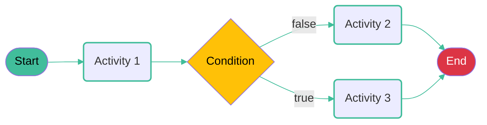

# Dapr Workflow

- Dapr has a built-in workflow engine, inspired by the Durable Task Framework.
- Workflows are defined in code.
- Workflows are stateful, and (should be) deterministic.
- Activities are the the building blocks of a workflow, they contain non-deterministic code.



---

# Workflow start example

```csharp
app.MapPost("/start", async (
    [FromBody] Input input,
    [FromServices] DaprWorkflowClient workflowClient) =>
{
    var instanceID = await workflowClient.ScheduleNewWorkflowAsync(
        nameof(MyWorkflow),
        input);
    
    return Results.Accepted($"/start/{instanceID}", new { instanceID });
});

```

---

# Workflow example

```csharp
public class MyWorkflow : Workflow<Input, Output>
{
    public override async Task<Output> RunAsync(
        WorkflowContext context, Input input)
    {
        var activity1Result = await context.CallActivityAsync<string>(
            nameof(MyActivity1), input);
        
        var result = await context.CallActivityAsync<string>(
            nameof(MyActivity2), activity1Result);

        return new Output(result);
    }
}
```

---

# Workflow Activity example

```csharp
public class MyActivity1 : Activity<Input, string>
{
    public override async Task<string> RunAsync(
        ActivityContext context, Input input)
    {
        var response = await CallLLMAsync(input);
        return response;
    }

    private Task<string> CallLLMAsync(Input input)
    {
        // Call to external LLM service
        ...
    }
}
```

