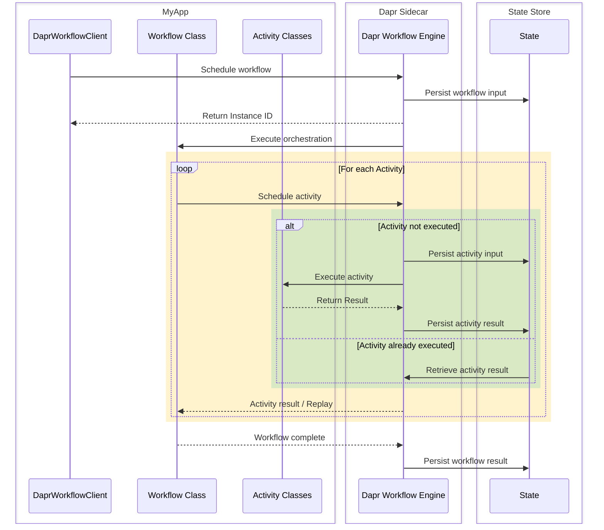

# Workflow Sequence Diagram

```mermaid
sequenceDiagram
    box MyApp
        participant Client as DaprWorkflowClient
        participant Workflow as Workflow Class
        participant Activity as Activity Classes
    end
    box Dapr Sidecar
        participant Engine as Dapr Workflow Engine
    end
    box State Store 
        participant State as State
    end

    Client->>Engine: Schedule workflow
    Engine->>State: Persist workflow input
    Engine-->>Client: Return Instance ID
    Engine->>Workflow: Execute orchestration
    rect rgba(255, 193, 7, 0.2)
    loop For each Activity
        Workflow->>Engine: Schedule activity
        rect rgba(65, 189, 155, 0.2)
        alt Activity not executed
        Engine->>State: Persist activity input
        Engine->>Activity: Execute activity
        Activity-->>Engine: Return Result
        Engine->>State: Persist activity result
        else Activity already  executed
            State->>Engine: Retrieve activity result
        end
        end
        Engine-->>Workflow: Activity result / Replay
    end
    end
    Workflow-->>Engine: Workflow complete
    Engine->>State: Persist workflow result
```
