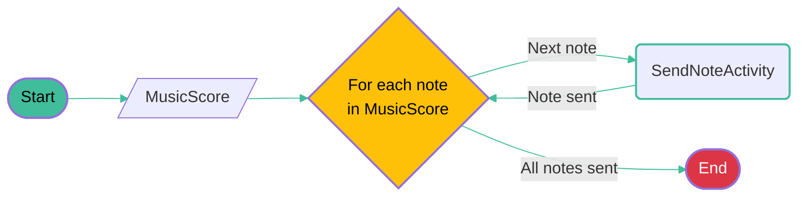

# MusicWorkflow

```mermaid
flowchart LR
    Start([Start]) --> Input[/MusicScore/]
    Input --> Loop{For each note
    in MusicScore}
    Loop -->|Next note| Activity(SendNoteActivity)
    Activity -->|Note sent| Loop
    Loop -->|All notes sent| Complete([End])

    style Start fill:#41bd9b,color:#000000,stroke-width:2px
    style Complete fill:#dc3545,color:#ffffff,stroke-width:2px
    style Loop fill:#ffc107,color:#000000,stroke-width:2px
    style Activity stroke:#41bd9b,stroke-width:2px
    linkStyle default stroke:#41bd9b,stroke-width:1px
```
