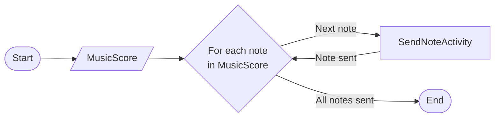

# MusicWorkflow

```mermaid
flowchart LR
    Start([Start]) --> Input[/MusicScore/]
    Input --> Loop{For each note
    in MusicScore}
    Loop -->|Next note| Activity[SendNoteActivity]
    Activity -->|Note sent| Loop
    Loop -->|All notes sent| Complete([End])
```
