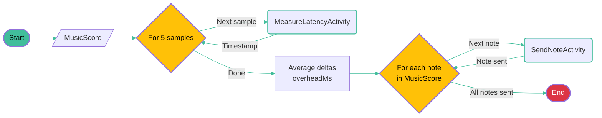

# MusicWorkflow with MeasureLatency

```mermaid
flowchart LR
    Start([Start]) --> Input[/MusicScore/]
    Input --> CalcLoop{For 5 samples}
    CalcLoop -->|Next sample| Measure(MeasureLatencyActivity)
    Measure -->|Timestamp| CalcLoop
    CalcLoop -->|Done| Avg[Average deltas
    overheadMs]
    Avg --> NoteLoop{For each note
    in MusicScore}
    NoteLoop -->|Next note| Send(SendNoteActivity)
    Send -->|Note sent| NoteLoop
    NoteLoop -->|All notes sent| Complete([End])

    style Start fill:#41bd9b,color:#000000,stroke-width:2px
    style Complete fill:#dc3545,color:#ffffff,stroke-width:2px
    style CalcLoop fill:#ffc107,color:#000000,stroke-width:2px
    style NoteLoop fill:#ffc107,color:#000000,stroke-width:2px
    style Measure stroke:#41bd9b,stroke-width:2px
    style Send stroke:#41bd9b,stroke-width:2px
    linkStyle default stroke:#41bd9b,stroke-width:1px
```
