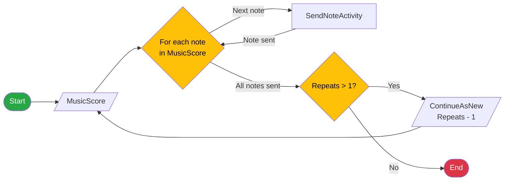

# MusicWorkflowV2

```mermaid
flowchart LR
    Start([Start]) --> Input[/MusicScore/]
    Input --> Loop{For each note
    in MusicScore}
    Loop -->|Next note| Activity[SendNoteActivity]
    Activity -->|Note sent| Loop
    Loop -->|All notes sent| Repeats{Repeats > 1?}
    Repeats -->|Yes| ContinueAsNew[/ContinueAsNew
    Repeats - 1/]
    ContinueAsNew --> Input
    Repeats -->|No| Complete([End])

    style Start fill:#28a745,color:#ffffff
    style Complete fill:#dc3545,color:#ffffff
    style Loop fill:#ffc107,color:#000000
    style Repeats fill:#ffc107,color:#000000
```
