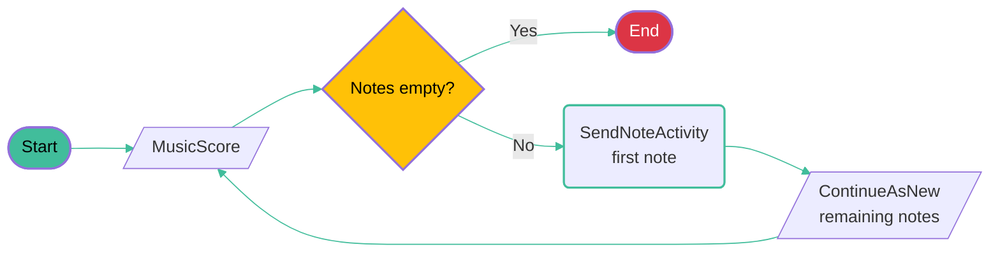

# MusicWorkflowV3

```mermaid
flowchart LR
    Start([Start]) --> Input[/MusicScore/]
    Input --> Empty{Notes empty?}
    Empty -->|Yes| Complete([End])
    Empty -->|No| Activity(SendNoteActivity
    first note)
    Activity --> ContinueAsNew[/ContinueAsNew
    remaining notes/]
    ContinueAsNew --> Input

    style Start fill:#41bd9b,color:#000000,stroke-width:2px
    style Complete fill:#dc3545,color:#ffffff,stroke-width:2px
    style Empty fill:#ffc107,color:#000000,stroke-width:2px
    style Activity stroke:#41bd9b,stroke-width:2px
    linkStyle default stroke:#41bd9b,stroke-width:1px
```
