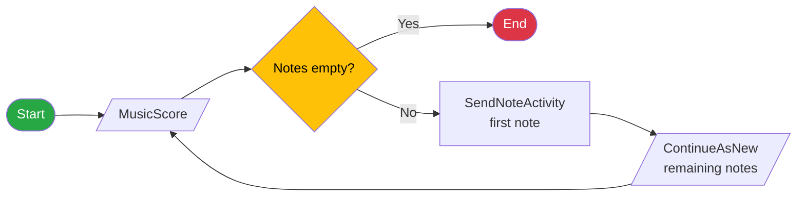

# MusicWorkflowV3

```mermaid
flowchart LR
    Start([Start]) --> Input[/MusicScore/]
    Input --> Empty{Notes empty?}
    Empty -->|Yes| Complete([End])
    Empty -->|No| Activity[SendNoteActivity
    first note]
    Activity --> ContinueAsNew[/ContinueAsNew
    remaining notes/]
    ContinueAsNew --> Input

    style Start fill:#28a745,color:#ffffff
    style Complete fill:#dc3545,color:#ffffff
    style Empty fill:#ffc107,color:#000000
```
