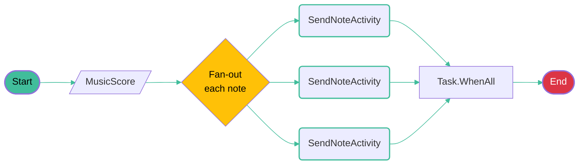

# MusicWorkflowV4 - Fan-out/fan-in

```mermaid
flowchart LR
    Start([Start]) --> Input[/MusicScore/]
    Input --> FanOut{Fan-out
    each note}
    FanOut --> A1(SendNoteActivity)
    FanOut --> A2(SendNoteActivity)
    FanOut --> A3(SendNoteActivity)
    A1 --> WhenAll[Task.WhenAll]
    A2 --> WhenAll
    A3 --> WhenAll
    WhenAll --> Complete([End])

    style Start fill:#41bd9b,color:#000000,stroke-width:2px
    style Complete fill:#dc3545,color:#ffffff,stroke-width:2px
    style FanOut fill:#ffc107,color:#000000
    style A1 stroke:#41bd9b,stroke-width:2px
    style A2 stroke:#41bd9b,stroke-width:2px
    style A3 stroke:#41bd9b,stroke-width:2px
    linkStyle default stroke:#41bd9b,stroke-width:1px
```
