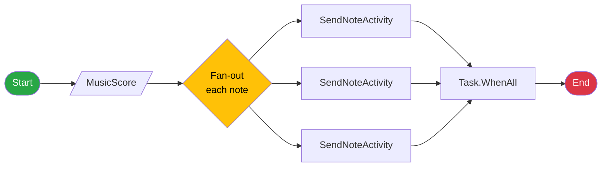

# MusicWorkflowV4

```mermaid
flowchart LR
    Start([Start]) --> Input[/MusicScore/]
    Input --> FanOut{Fan-out
    each note}
    FanOut --> A1[SendNoteActivity]
    FanOut --> A2[SendNoteActivity]
    FanOut --> A3[SendNoteActivity]
    A1 --> WhenAll[Task.WhenAll]
    A2 --> WhenAll
    A3 --> WhenAll
    WhenAll --> Complete([End])

    style Start fill:#28a745,color:#ffffff
    style Complete fill:#dc3545,color:#ffffff
    style FanOut fill:#ffc107,color:#000000
```
