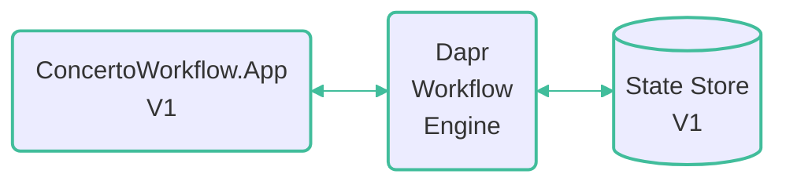
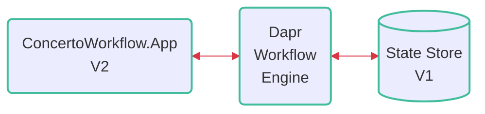

# Workflow versioning

*Workflow V1*

```mermaid
flowchart LR
    CWA(ConcertoWorkflow.App
    V1)<-->DAPR(Dapr
    Workflow
    Engine)
    DAPR<-->SS[(State Store
    V1)]

    classDef default stroke:#41bd9b,stroke-width:2px
    linkStyle default stroke:#41bd9b,stroke-width:1px
```

*After deployment of V2 with in-flight workflow executions*

```mermaid
flowchart LR
    CWA(ConcertoWorkflow.App
    V2)<-->DAPR(Dapr
    Workflow
    Engine)
    DAPR<-->SS[(State Store
    V1)]

    classDef default stroke:#41bd9b,stroke-width:2px
    linkStyle default stroke:#dc3545,stroke-width:1px
```
