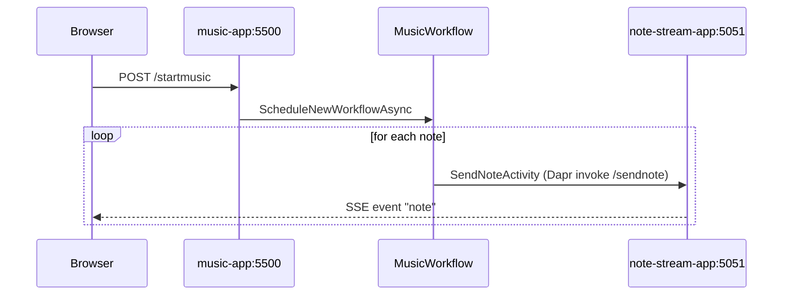

# Concerto Workflow — Aspire Solution

A .NET Aspire orchestration of the Dapr Workflow Concerto demo. This solution wraps copies of the workflow service and the SSE/frontend service so they run together via `aspire run`, with Valkey as the workflow state store and the Diagrid Dev Dashboard as a container resource.

The original projects under `../ConcertoWorkflow/` and `../NoteStreamApp/` are not modified — this folder is a parallel, self-contained copy.

## Architecture

- **`ConcertoWorkflow.AppHost`** — Aspire entry point. Defines four resources: a Valkey container (port 16379), the `music-app` workflow service with a Dapr sidecar (port 5500), the `note-stream-app` SSE/frontend service with a Dapr sidecar (port 5051), and the Diagrid Dev Dashboard container (port 8080).
- **`ConcertoWorkflow.ServiceDefaults`** — Aspire-shared OpenTelemetry, health checks, resilience, and service discovery setup. Referenced by both service projects.
- **`ConcertoWorkflowApp`** — Workflow service (app ID `music-app`). Uses `Dapr.Workflow` and `Dapr.Workflow.Versioning`. Activities call `note-stream-app` via Dapr service invocation.
- **`NoteStreamApp`** — SSE service (app ID `note-stream-app`) that queues notes and streams them to the browser. Hosts the static P5.js frontend from `wwwroot/`.



## Prerequisites

- [.NET 10 SDK](https://dotnet.microsoft.com/en-us/download)
- [Aspire CLI](https://aspire.dev/get-started/install-cli/)
- [Docker](https://www.docker.com/products/docker-desktop/) or [Podman](https://podman.io/docs/installation)
- [Dapr CLI](https://docs.dapr.io/getting-started/install-dapr-cli/)

You do **not** need to start Redis, Valkey, or run `dapr init` separately — Aspire manages the Valkey container and the Dapr sidecars.

## Run locally

From this folder:

```shell
aspire run
```

The Aspire dashboard opens automatically in your browser. From the resource list:

- Click the `note-stream-app` HTTP endpoint (or open <http://localhost:5051>) to load the P5.js frontend.
- Click the `diagrid-dashboard` HTTP endpoint to inspect workflow instances.
- Use the `music-app` HTTP endpoint (<http://localhost:5500>) to call workflow APIs directly.

## Endpoints

All workflow endpoints live on `http://localhost:5500`. The full request set with examples is in [`ConcertoWorkflowApp/ConcertoWorkflowApp.http`](ConcertoWorkflowApp/ConcertoWorkflowApp.http) — open it in VS Code (REST Client extension) or JetBrains Rider/IntelliJ to fire requests interactively.

Quick examples with curl:

```shell
# Start a workflow
curl -X POST http://localhost:5500/startmusic \
  -H "Content-Type: application/json" \
  -d '{
        "title":"Demo",
        "bpm":120,
        "repeats":1,
        "notes":[{"id":"n1","noteName":"C4","type":"note","noteLength":"1/4","interval":"1/4"}]
      }'

# Get status (replace <id> with the instanceId from the start response)
curl http://localhost:5500/musicstatus/<id>

# Pause / resume / terminate
curl -X POST http://localhost:5500/pause/<id>
curl -X POST http://localhost:5500/resume/<id>
curl -X POST http://localhost:5500/terminate/<id>

# Approve event (raises an "approve" event in the workflow)
curl -X POST http://localhost:5500/approve/<id>/true
```

## Inspect workflows

Open the **Diagrid Dev Dashboard** from the Aspire dashboard's resource list. It connects to the same Valkey state store as the workflow sidecar (via `host.docker.internal:16379`) and shows running and completed workflow instances with their full execution history.
