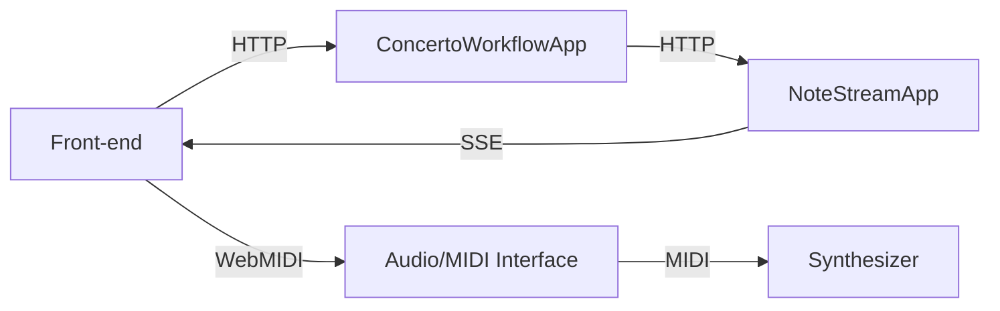

# Dapr Workflow Concerto

A Dapr Workflow demo that orchestrates music playback across two .NET microservices with real-time P5.js visualization. The ConcertoWorkflow service drives the orchestration while NoteStreamApp streams notes to the browser via Server-Sent Events (SSE), where a P5.js canvas visualizes the music and Web MIDI or Web Audio handles playback.

## Architecture



| Component | Description |
|---|---|
| **Front-end** | P5.js canvas served from NoteStreamApp. Connects to SSE for real-time note events and sends HTTP requests to start/control the workflow. |
| **ConcertoWorkflowApp** (`music-app`, port 5500) | Dapr Workflow orchestration service. Runs `MusicWorkflow` which loops through music scores and invokes activities to send notes. |
| **NoteStreamApp** (`note-stream-app`, port 5051) | Receives notes via Dapr service invocation, queues them as SSE events, and serves the front-end static files. |
| **Audio/MIDI Interface** | Optional hardware interface that routes MIDI messages from the browser to an external synthesizer. |
| **Synthesizer** | External hardware synth that produces the actual sound when using Web MIDI playback. |

## Prerequisites

- [.NET 10 SDK](https://dotnet.microsoft.com/download)
- [Dapr CLI](https://docs.dapr.io/getting-started/install-dapr-cli/) (with `dapr init` completed)
- [Docker](https://www.docker.com/) (required by Dapr)
- A modern browser (Chrome or Edge recommended for Web MIDI support)
- Optional: a hardware MIDI synthesizer connected via an audio/MIDI interface

## Running the project

1. Start both services with Dapr:

   ```bash
   dapr run -f dapr.yaml
   ```

2. Open [http://localhost:5051](http://localhost:5051) in your browser.

## Audio playback: Web MIDI vs Web Audio

The front-end supports two playback modes, selectable via the **Playback Type** dropdown at the top of the page. If a MIDI device is detected the type is set to **midi** by default. If no MIDI device is detected the type is set to **audio**.

### Web MIDI

Sends MIDI messages to a hardware synthesizer connected through an audio/MIDI interface. Select the target MIDI device in the dropdown. This requires:

- A browser that supports the Web MIDI API (Chrome/Edge).
- A MIDI-capable synthesizer connected to your machine.

### Web Audio

Uses the browser's built-in Web Audio API with oscillator-based synthesis — no external hardware needed. 
