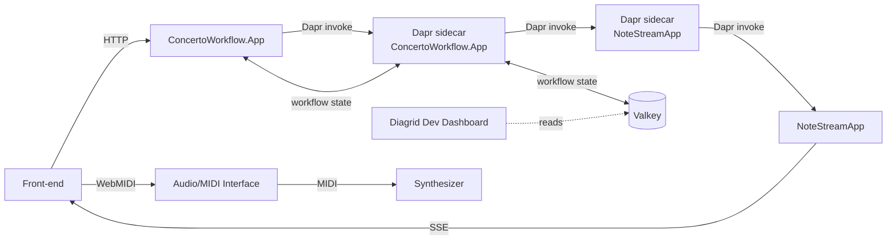

# Dapr Workflow Concerto

A Dapr Workflow demo that orchestrates music playback across two .NET services with real-time P5.js visualization. The whole stack — both services, their Dapr sidecars, a Valkey state store, and the Diagrid Dev Dashboard — runs together under .NET Aspire. The `ConcertoWorkflow.App` service drives the orchestration, while `NoteStreamApp` streams notes to the browser via Server-Sent Events (SSE), where a P5.js canvas visualizes the music and Web MIDI or Web Audio handles playback.

## Architecture



| Component | Description |
|---|---|
| **Front-end** | P5.js canvas served from NoteStreamApp. Connects to SSE for real-time note events and sends HTTP requests to start/control the workflow. |
| **ConcertoWorkflow.AppHost** | .NET Aspire entry point. Wires up Valkey, both service projects with their Dapr sidecars, and the Diagrid Dev Dashboard container. |
| **ConcertoWorkflow.ServiceDefaults** | Aspire-shared OpenTelemetry, health checks, resilience, and service discovery. Referenced by both service projects. |
| **ConcertoWorkflow.App** (`music-app`, port 5500) | Dapr Workflow orchestration service. `MusicWorkflow` loops through music scores and invokes activities to send notes. |
| **NoteStreamApp** (`note-stream-app`, port 5051) | Receives notes via Dapr service invocation, queues them as SSE events, and serves the front-end static files. |
| **Dapr sidecars** | One sidecar per service (managed by Aspire). Handle service-to-service invocation between `music-app` and `note-stream-app`, and back the Dapr Workflow runtime in `music-app` with Valkey as the state store. |
| **Valkey** (port 16379) | Workflow state store, used by the `music-app` Dapr sidecar to persist workflow execution history. |
| **Diagrid Dev Dashboard** (port 8888) | Container that reads from the same Valkey instance to inspect running and completed workflow instances. |
| **Audio/MIDI Interface** | Optional hardware interface that routes MIDI messages from the browser to an external synthesizer. |
| **Synthesizer** | External hardware synth that produces sound when using Web MIDI playback. |

## Prerequisites

- [.NET 10 SDK](https://dotnet.microsoft.com/download)
- [Aspire CLI](https://aspire.dev/get-started/install-cli/)
- [Docker](https://www.docker.com/) or [Podman](https://podman.io/docs/installation)
- [Dapr CLI](https://docs.dapr.io/getting-started/install-dapr-cli/)
- A modern browser (Chrome or Edge recommended for Web MIDI support)
- Optional: a hardware MIDI synthesizer connected via an audio/MIDI interface

## Running the project

From the repository root:

```bash
cd ConcertoWorkflowSolution
aspire run
```

The Aspire dashboard opens automatically in your browser. From the resource list:

- Open the `note-stream-app` HTTP endpoint (or [http://localhost:5051](http://localhost:5051)) to load the P5.js frontend.
- Open the `diagrid-dashboard` HTTP endpoint (or [http://localhost:8888](http://localhost:8888)) to inspect workflow instances.
- Use the `music-app` HTTP endpoint ([http://localhost:5500](http://localhost:5500)) to call workflow APIs directly.

## Endpoints

All workflow endpoints live on `http://localhost:5500`. The full request set with examples is in [`ConcertoWorkflowSolution/ConcertoWorkflow.App/ConcertoWorkflow.App.http`](ConcertoWorkflowSolution/ConcertoWorkflow.App/ConcertoWorkflow.App.http) — open it in VS Code (REST Client extension) or JetBrains Rider/IntelliJ to fire requests interactively.

Quick examples with curl:

```bash
# Start a workflow
curl -X POST http://localhost:5500/startmusic \
  -H "Content-Type: application/json" \
  -d '{
        "title":"Demo",
        "bpm":120,
        "repeats":1,
        "notes":[{"id":"n1","noteName":"C4","type":"note","noteLength":"1/4","interval":"1/4"}]
      }'

# Get status (replace <id> with the instanceId from the start response)
curl http://localhost:5500/musicstatus/<id>

# Pause / resume / terminate
curl -X POST http://localhost:5500/pause/<id>
curl -X POST http://localhost:5500/resume/<id>
curl -X POST http://localhost:5500/terminate/<id>

# Approve event (raises an "approve" event in the workflow)
curl -X POST http://localhost:5500/approve/<id>/true
```

## Inspect workflows

Open the **Diagrid Dev Dashboard** from the Aspire dashboard's resource list. It connects to the same Valkey state store as the `music-app` Dapr sidecar and shows running and completed workflow instances with their full execution history.

## Audio playback: Web MIDI vs Web Audio

The front-end supports two playback modes, selectable via the **Playback Type** dropdown at the top of the page. If a MIDI device is detected the type is set to **midi** by default. If no MIDI device is detected the type is set to **audio**.

### Web MIDI

Sends MIDI messages to a hardware synthesizer connected through an audio/MIDI interface. Select the target MIDI device in the dropdown. This requires:

- A browser that supports the Web MIDI API (Chrome/Edge).
- A MIDI-capable synthesizer connected to your machine.

### Web Audio

Uses the browser's built-in Web Audio API with oscillator-based synthesis — no external hardware needed.

## Learn more

- Learn Dapr with [Dapr University](https://www.diagrid.io/dapr-university).
- Join the [Dapr Discord](http://diagrid.ws/dapr-discord)!
- [Try Catalyst](https://www.diagrid.io/catalyst) to run & operate your workflows.
